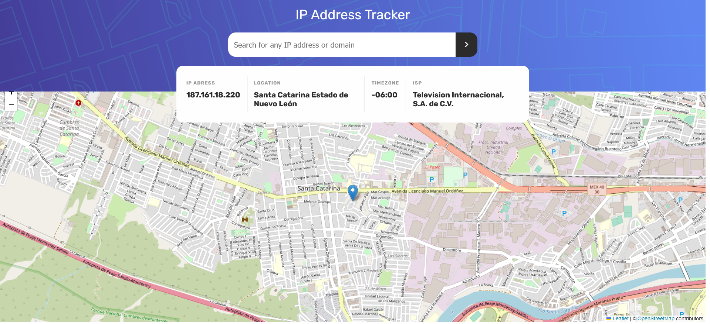

# Frontend Mentor - IP address tracker solution

This is a solution to the [IP address tracker challenge on Frontend Mentor](https://www.frontendmentor.io/challenges/ip-address-tracker-I8-0yYAH0). 

## Table of contents

- [Overview](#overview)
  - [The challenge](#the-challenge)
  - [Screenshot](#screenshot)
  - [Links](#links)
- [My process](#my-process)
  - [Built with](#built-with)
  - [What I learned](#what-i-learned)
  - [Useful resources](#useful-resources)

## Overview

### The challenge

Users should be able to:

- View the optimal layout for each page depending on their device's screen size
- See hover states for all interactive elements on the page
- See their own IP address on the map on the initial page load
- Search for any IP addresses or domains and see the key information and location

### Screenshot

### Links

- Solution URL: [github.com/davidbriseo/IP-Address-Tracker](https://github.com/davidbriseo/IP-Address-Tracker)
- Live Site URL: [IP-Address-Tracker live site](https://bespoke-malabi-5001f5.netlify.app/)

## My process

### Built with

- Semantic HTML5 markup
- CSS custom properties
- Flexbox
- CSS Grid
- Mobile-first workflow
- [React](https://reactjs.org/) - JS library

### What I learned

1. This is the first time working with a more complex API like the Leaflet API, it was challenging to get it to work. Turns out you need something called the React Leaflet, to make it work with React.
2. Using .env files to store app secrets is not secure to do it from the frontend. Making a server is required for the API key to be stored securely.  

### Useful resources

- [IP Geolocation API](https://geo.ipify.org/) 
- [Leaflet](https://leafletjs.com/)  
- [React Leaflet](https://react-leaflet.js.org/)
- [Introduction and Displaying a Map with React Leaflet](https://www.youtube.com/watch?v=62Y8SFi2wBk&t) - This is an amazing video which helped me understand React leaflet. I'd recommend it to anyone still learning this concept.

